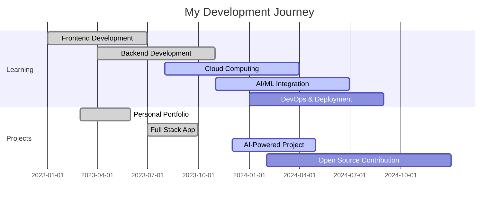

<div align="center">
  
</div>

<div align="center">
  
</div>

<div align="center">
  
  
  
</div>


## 🚀 About Me


```typescript
const lakshya = {
    pronouns: "He/Him",
    code: ["TypeScript", "Python", "Java", "C++", "JavaScript"],
    askMeAbout: ["Web Dev", "AI/ML", "Cloud Computing", "Open Source"],
    technologies: {
        frontend: ["React", "Next.js", "Vue.js", "TypeScript"],
        backend: ["Node.js", "Python", "Django", "FastAPI"],
        database: ["MongoDB", "PostgreSQL", "MySQL"],
        cloud: ["AWS", "Firebase", "Heroku", "Vercel"],
        tools: ["Docker", "Git", "GitHub Actions", "Postman"]
    },
    currentFocus: "Building scalable web applications with modern technologies",
    funFact: "I debug with console.log() and I'm not ashamed! 😄"
};
```


## 🌐 Connect With Me

<div align="center">
  <a href="https://linkedin.com/in/lakshya-verma-a79745255" target="_blank">
    
  </a>
  <a href="mailto:lakshya123kl@gmail.com" target="_blank">
    
  </a>
  <a href="https://portfolio-six-peach-12.vercel.app/" target="_blank">
    
  </a>
  <a href="https://open.spotify.com/user/r2cvcosws0vccxs3w5pt3snwj?si=27bab99ac7fb4dce" target="_blank">
    
  </a>
</div>


## 💻 Tech Arsenal

<div align="center">

### 🔥 Languages


### ⚡ Frontend


### 🚀 Backend


### 🗄️ Databases


### ☁️ Cloud & Tools


### 🧠 AI/ML


</div>


## 📊 GitHub Analytics

<div align="center">
  
  
</div>

<div align="center">
  
  
</div>


## 🏆 GitHub Achievements

<div align="center">
  
</div>

<div align="center">
  
</div>


## 🎯 Current Focus

<div align="center">
  
</div>




## 💡 Random Dev Wisdom

<div align="center">
  
</div>

## 🐍 Contribution Snake

<div align="center">
  
</div>


## 📈 Weekly Development Breakdown

<!--START_SECTION:waka-->
```text
TypeScript   8 hrs 15 mins   ████████████░░░░░░░░░░░░░   48.2%
Python       4 hrs 30 mins   ██████░░░░░░░░░░░░░░░░░░░   26.3%
JavaScript   2 hrs 45 mins   ████░░░░░░░░░░░░░░░░░░░░░   16.1%
CSS          1 hr 35 mins    ██░░░░░░░░░░░░░░░░░░░░░░░   9.3%
JSON         0 hrs 5 mins    ░░░░░░░░░░░░░░░░░░░░░░░░░   0.1%
```
<!--END_SECTION:waka-->


## 🎵 Spotify Playing

<div align="center">
  
</div>

<div align="center">
  <a href="https://open.spotify.com/user/r2cvcosws0vccxs3w5pt3snwj?si=27bab99ac7fb4dce" target="_blank">
    
  </a>
</div>


<div align="center">
  
</div>

<div align="center">
  <h3>💭 "Code is poetry written in logic"</h3>
  <p><i>✨ Making the web a better place, one commit at a time ✨</i></p>
  
  
</div>
